# Developing AI Applications with Python and Flask

This repository contains the final project for the course 
[Developing AI Applications with Python and Flask](https://www.coursera.org/learn/python-project-for-ai-application-development) by [IBM](https://cloud.ibm.com/) on [Coursera](https://www.coursera.org).

## TASKS

### Task1: Clone the project repository 🌿

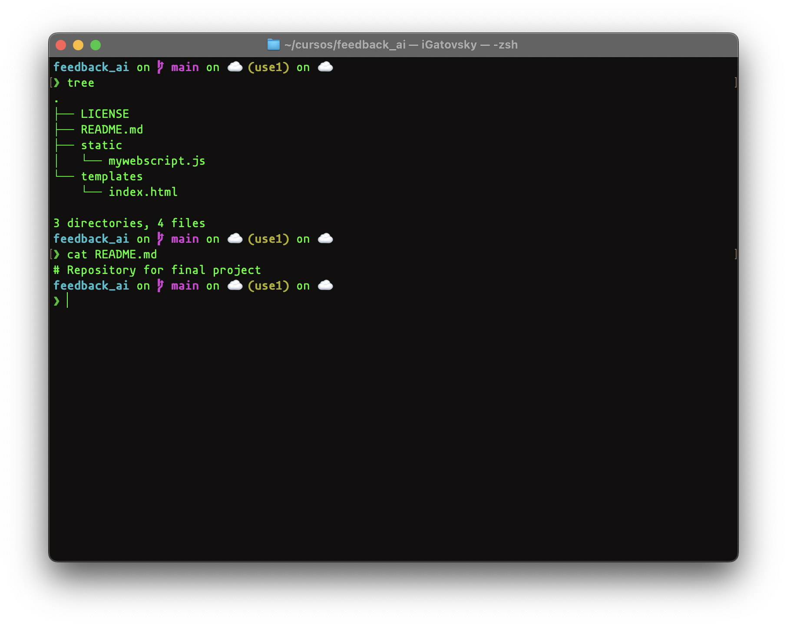

### Task 2: Create an emotion detection application using Watson NLP library 🤖

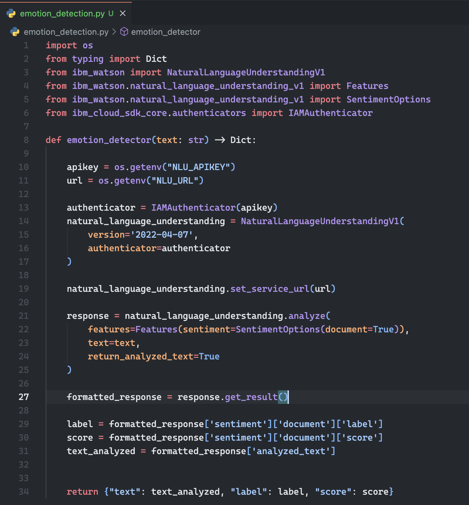

---

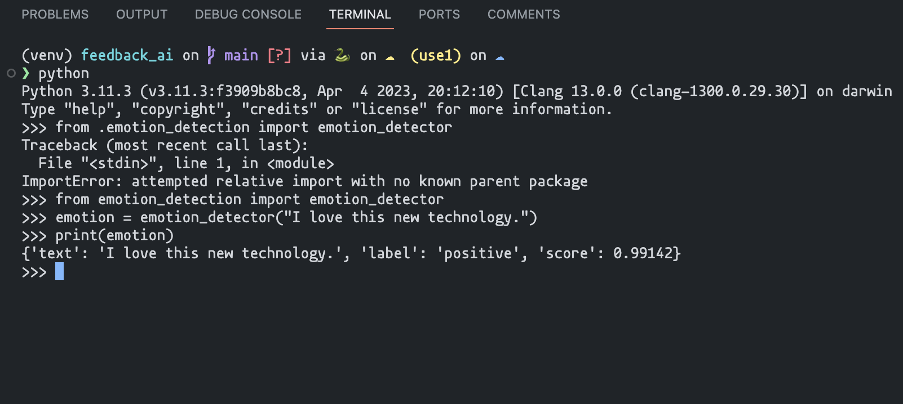

### Task 3: Format the output of the application 🧑🏼‍💻

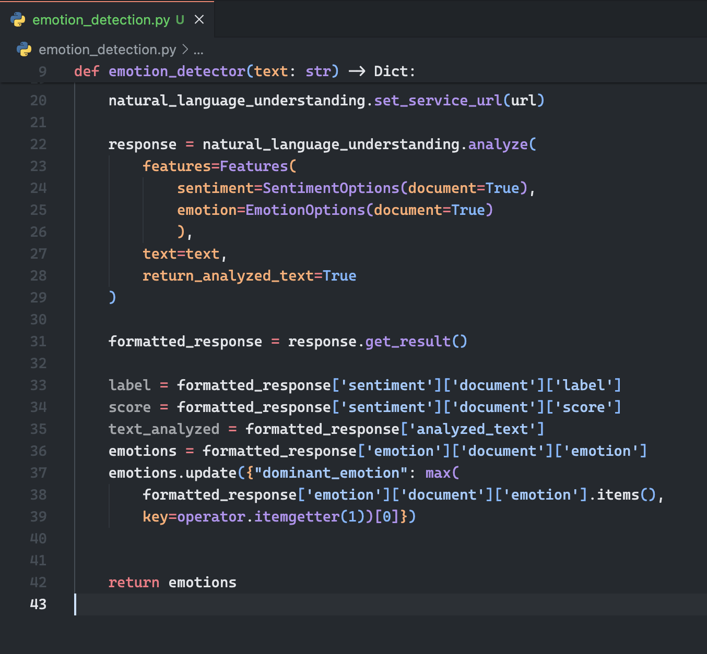

---
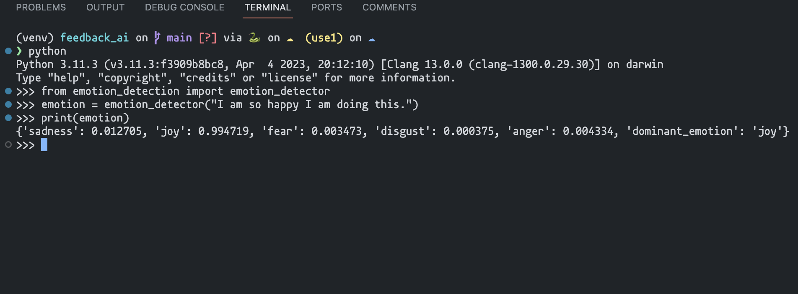

### Task 4: Package the application 📦

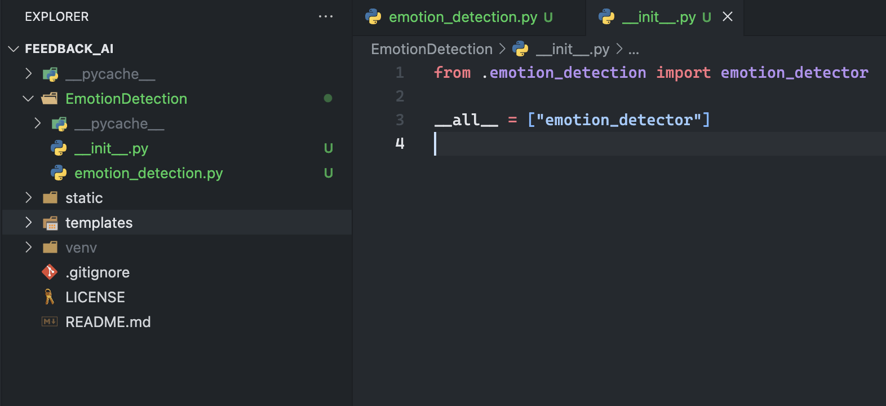

---

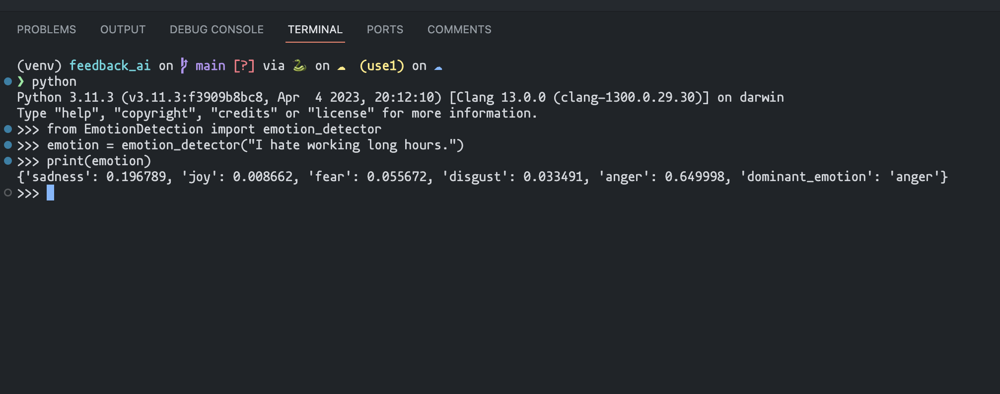

### Task 5: Run Unit tests on your application 🧪

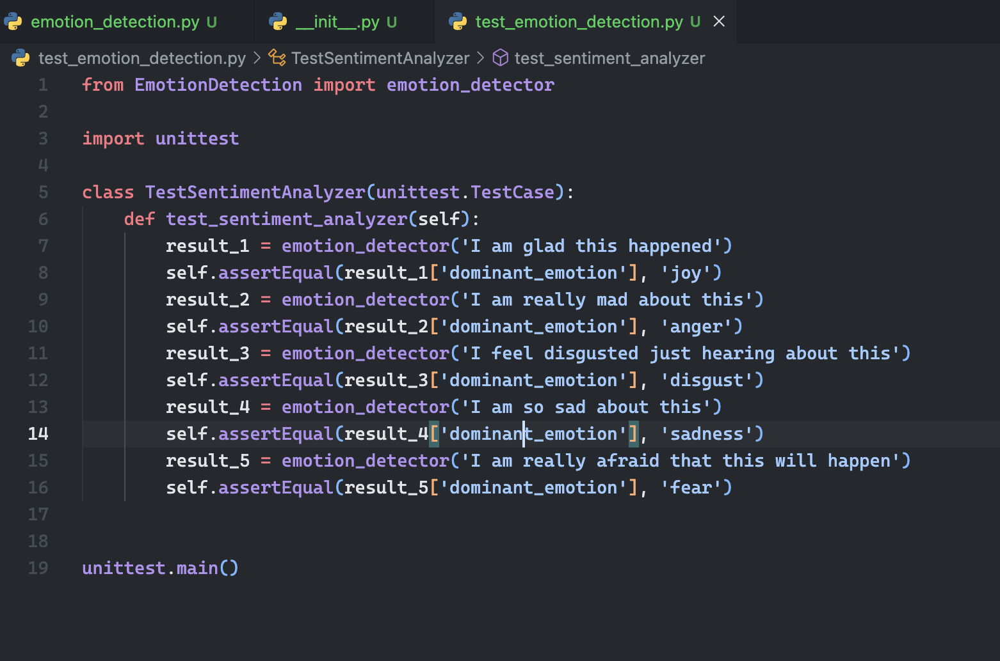

---

### Task 6: Web deployment of the application using Flask 🌐

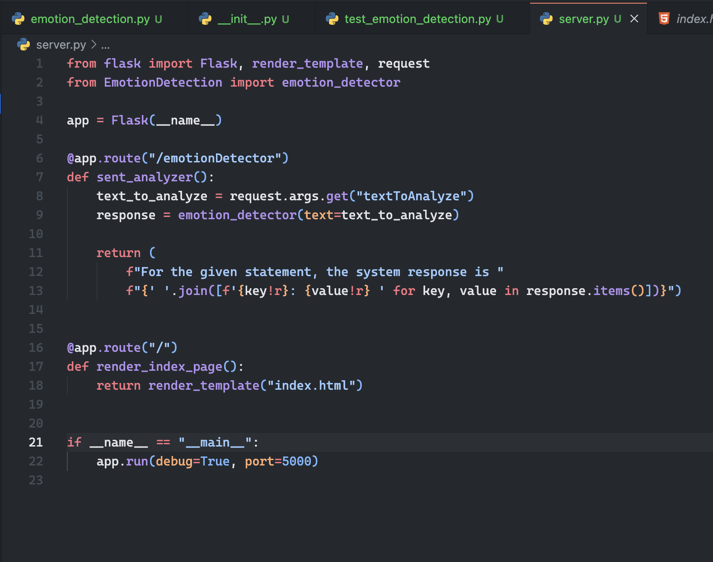

---

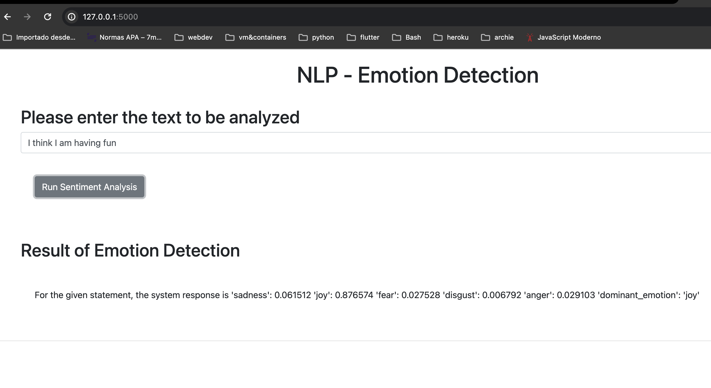

### Incorporate Error handling 🚨

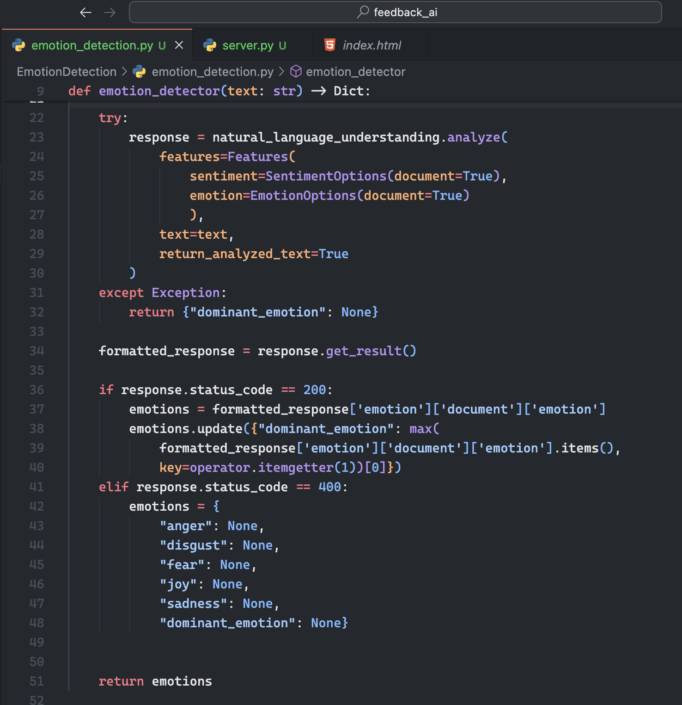

---

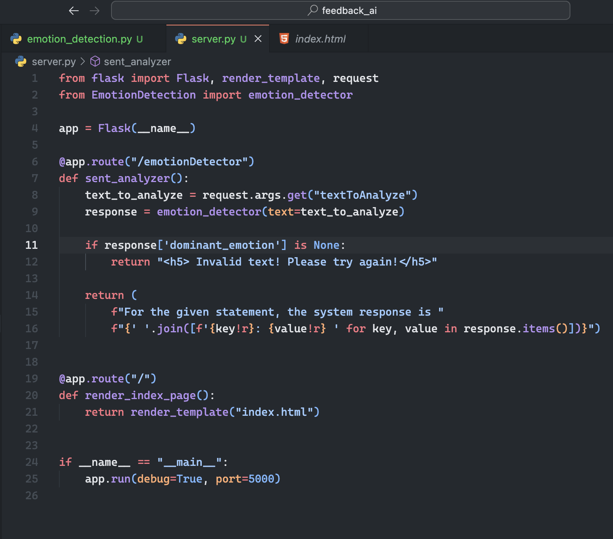

---

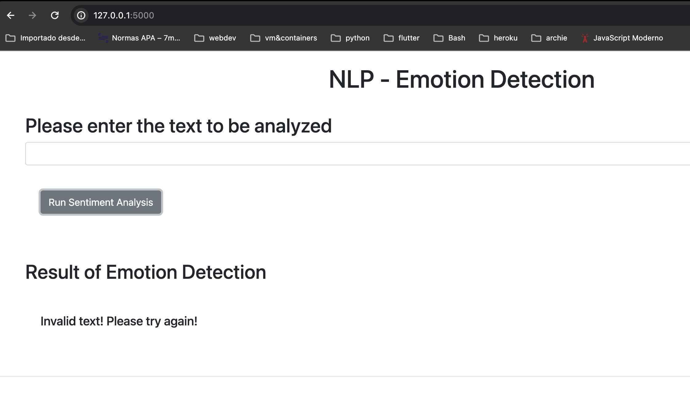

### Task 8: Run static code analysis 📊

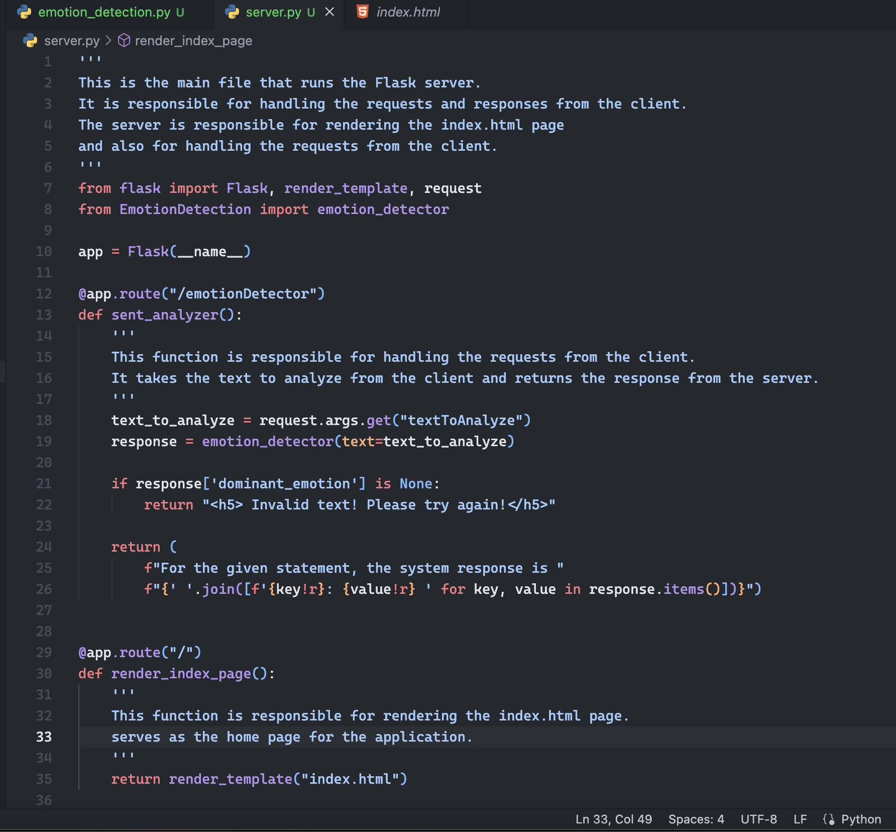

---

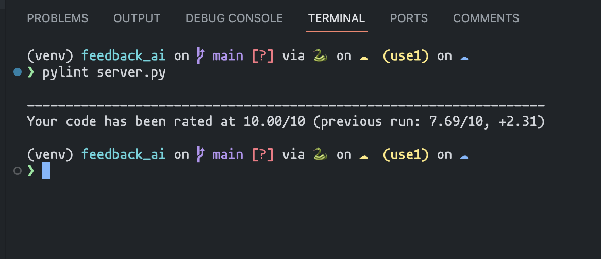